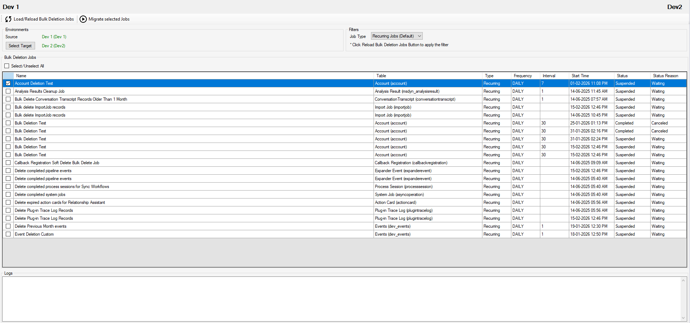

# Bulk Delete Migrator

Bulk Delete Migrator is an [XrmToolBox plugin](https://www.xrmtoolbox.com/plugins/RVG.XrmToolBox.BulkDeleteMigrator/) for Microsoft Dynamics 365 that allows admins to seamlessly migrate/copy Recurring and Non-recurring bulk deletion jobs between environments. This eliminates the need to recreate them manually, as these jobs are not solution aware.

## 📦 Installation

1. Open **XrmToolBox**.
2. Go to the **Tool Library**.
3. Search for **Bulk Delete Migrator**.
4. Click **Install**.

## 🛠️ How to Use

1. Open the Bulk Delete Migrator tool in XrmToolbox.
2. Choose Job Type Filter (Optional): By default, Recurring jobs are selected. But you can use the dropdown to filter the jobs based on your preference:
   - Recurring Jobs (Default)
   - Non-Recurring Jobs
   - All Jobs
4. Click on **Load/Reload Bulk Deletion Jobs** button to fetch the bulk deletion jobs in the source environment *(If you aren't connected to a source environment, you will be prompted to select one)*.
5. Use the checkboxes to choose the jobs you wish to migrate.
6. Select the Target Environment and click the **Migrate Selected Jobs** button to transfer the selected jobs to the target environment
7. Check the **Logs** section at the bottom for detailed feedback on the migration
